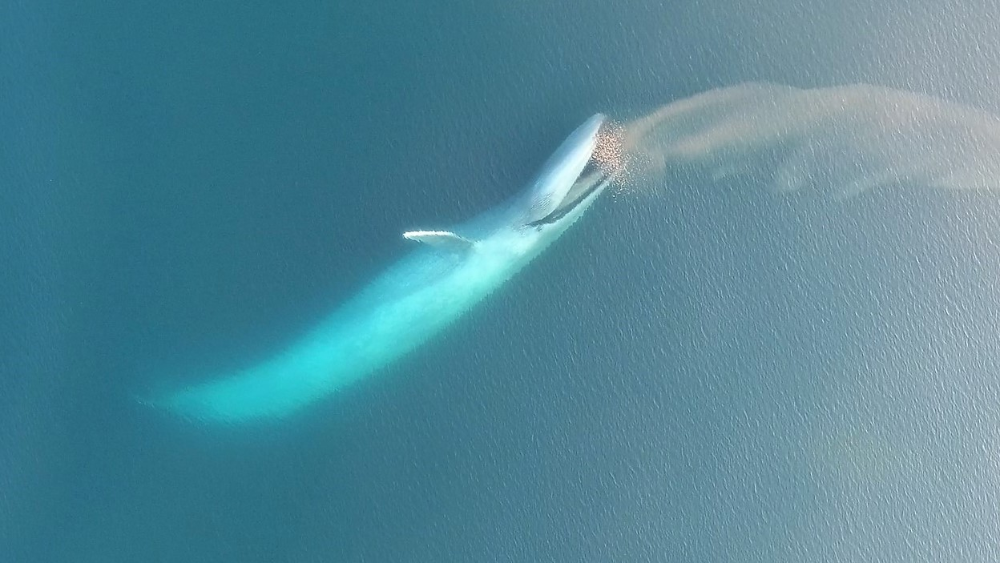
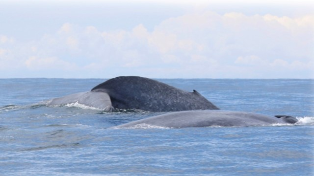
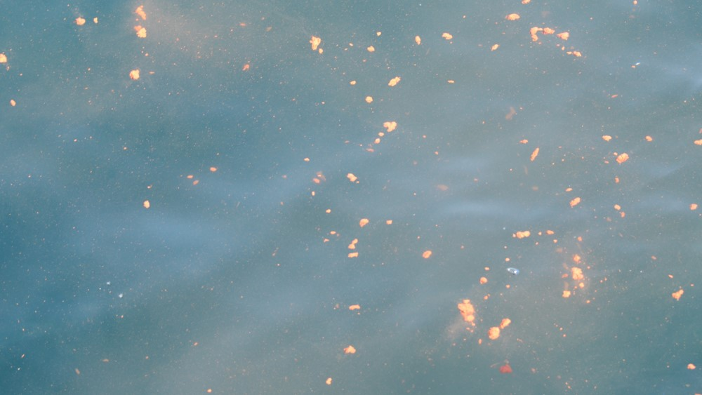
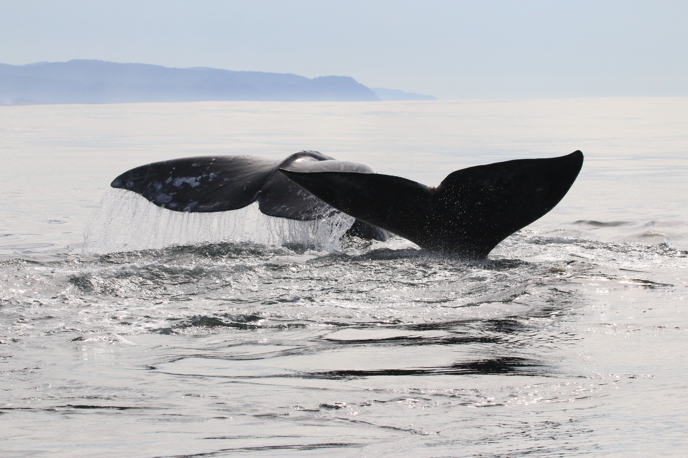
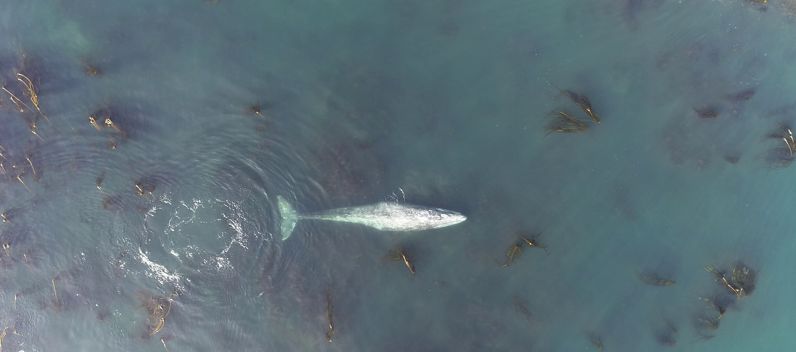
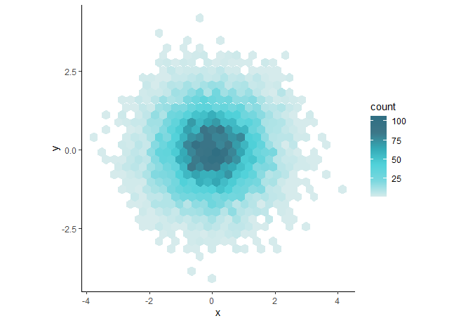
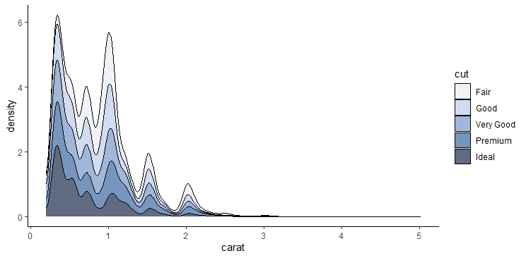

# musculusColors
Blue whale inspired R color palette, with some gray whales thrown in there :)

The colors of our favorite whale species saved in R color palettes. Inspired by the images of the whales they study [GEMM lab](https://mmi.oregonstate.edu/gemm-lab) graduate students [Dawn Barlow](https://github.com/dawnbarlow) and [Clara Bird](https://github.com/cbirdferrer) have created this R color palette package.


The [`paletter`](http://www.milanor.net/blog/build-color-palette-from-image-with-paletter/) package was used to extract color from images and structure of code was inspired by the [`PNWColors`](https://github.com/jakelawlor/PNWColors) package.

Image Copyright GEMM Lab, Marine Mammal Institute, Oregon State University.  
Gray whale images collected under NOAA/NMFS permit #16111 and #21678.  


## Install
```r
# dev version
library(devtools)
devtools::install_github("dawnbarlow/musculusColors")
```

## Running the package
```r
library(musculusColors)
names(Bm_palettes)
  [1] "Bmlunge"   "Bmsurface" "Bmpoop"    "ErFluke"   "ErHead"    "ErMole"   
  [7] "ErWhale"
```

## Palettes

### Blue Whales (Balaenoptera musculus)

```r
musculus_palette("Bmlunge", n=50)
```


```r
musculus_palette("Bmsurface", n=100)
```


```r
musculus_palette("Bmpoop")
```


### Gray Whales (Eschrichtius robustus)
```r
musculus_palette("ErFluke")
```


```r
musculus_palette("ErWhale")
```


```r
musculus_palette("ErHead")
```


```r
musculus_palette("ErMole")
```


## Example Plots
```r
ggplot(data.frame(x = rnorm(1e4), y = rnorm(1e4)), aes(x = x, y = y)) +
  geom_hex() +
  coord_fixed() +
  scale_fill_gradientn(colours = musculus_palette("Bmlunge", n=50)) +
  theme_classic()
```


```r
ggplot(diamonds, aes(carat, fill = cut)) +
  geom_density(position = "stack") +
  scale_fill_manual(values=musculus_palette("Bmsurface",5, type = "discrete"))  +
  theme_classic()
```


```r
ggplot(diamonds, aes(x=cut, y=carat, fill = cut)) +
  geom_boxplot() +
  scale_fill_manual(values=musculus_palette("Bmpoop", 5))  +
  theme_classic()
```

